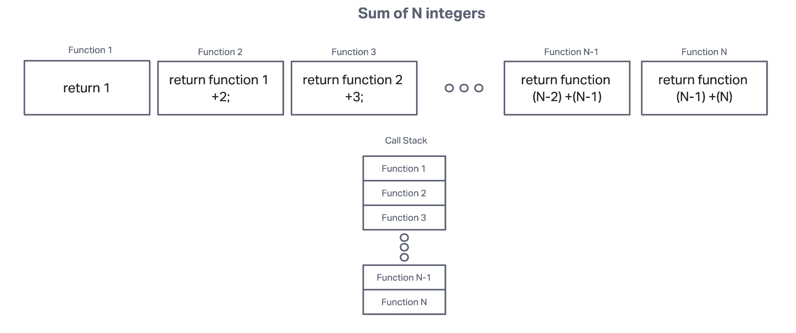

# Class 10

[Journal Home](README.md)

Current Readings:

1. [Understanding the JavaScript Call Stack](https://www.freecodecamp.org/news/understanding-the-javascript-call-stack-861e41ae61d4)
2. [JavaScript error messages](https://codeburst.io/javascript-error-messages-debugging-d23f84f0ae7c)

## Reading Notes

### Understanding the JavaScript Call Stack

1. A call occurs when a function is invoked. However, if a function relies on external functions, then a call stack must be constructed for `Javascript` to run through the function linearly.
2. There is only one cal at a time. However, the call stack allows for multiple calls to be stored in memory until the call chain is terminated.
3. LIFO means last in first out. When there are nested functions a function will invoke the functions within in the initial function. Each function invocation results in another function being added to the call stack. When the call stack reaches an endpoint, the most recently added function will be executed and then the dominos will commence until there are not function invocations in the call stack.
4. 
5. A Stack Overflow occurs when the compiler meets it's maximum memory designated to the call stack. This max memory can be easily met when a function invocation in circular, that is when a function calls itself.

### JavaScript error messages

1. When a variable is referenced when it has not been initialized a object is created called a `ReferenceError`
2. When tokens are out of order or when tokens appear in the incorrect location than what was defined by the `js` parsing mechanics. A `SyntaxError` object in created.
3. This can occur when calling an index that is not defined in an array. A `RangeError` object is created.
4. Is when a function is not able to execute a method or operation on a given datatype. For example, one can not use the `.map` method on an object or string, only an array. A `TypeError` is created.
5. A breakpoint ends the program at a given point of execution. Breakpoint can either be absolute or be conditional.
6. Debugging is the process of determining what bugs are in the code. Typing `debugger` calls a function that has been defined to be invoked if that line is reached. If a function is not defined under the debugger than nothing happens when `debugger` is reached.

### Things I want to know more about

How do you set a function to be invoked when `debugger` is reached?

&copy; 2022, NoMichi
