# Class 00

[Journal Home](README.md)

Current Readings:

[Introduction to SQL](https://sqlbolt.com/)

## Reading Notes

Relational databases are a great way to organize millions to billions of instances of some data type. In addition, relational databases can relate several tables to one another. If not all the instances have the same data types then multiple tables can be a great way to circumvent empty elements in a table. You can have an id for each instance for the single source of truth (or a basis of shared properties between all of the instances). The addition tables allow for shared properties of a subset of the instances.

SQL is a shared language that many relational databases use to allow for their users to navigate their data. Data can be searching using several logical filters.

Images from lessons 1-6 and lessons 13-18.
 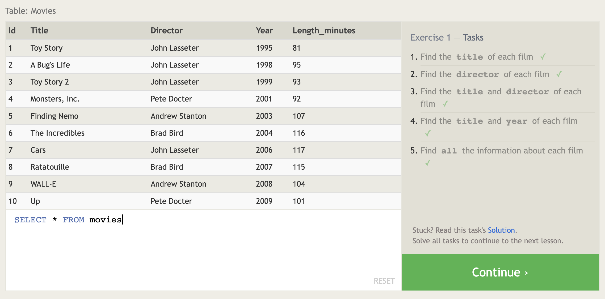
 
 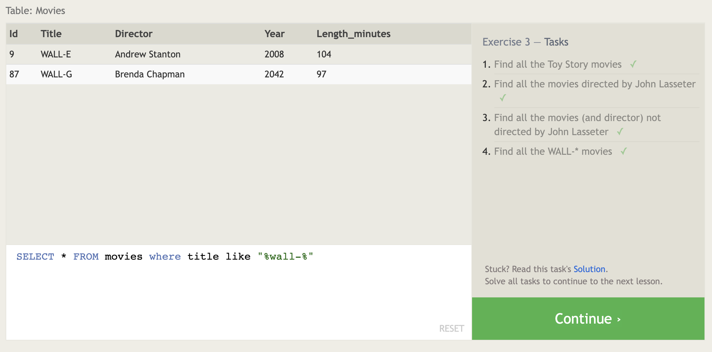
 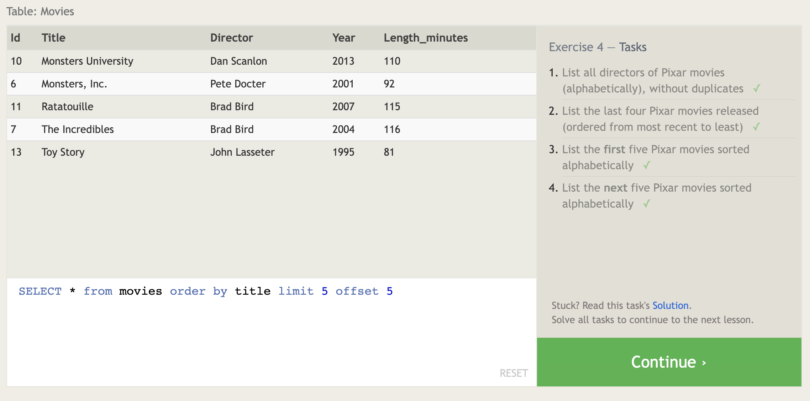
 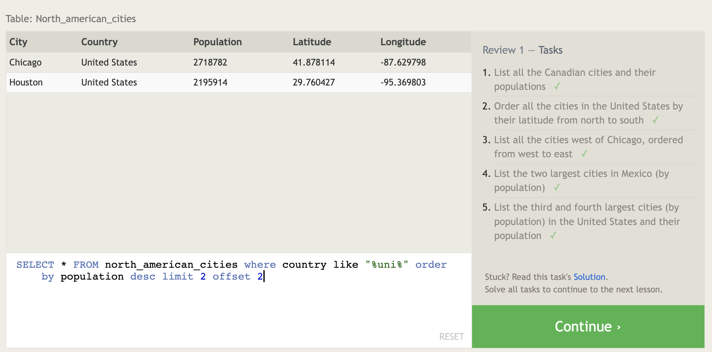
 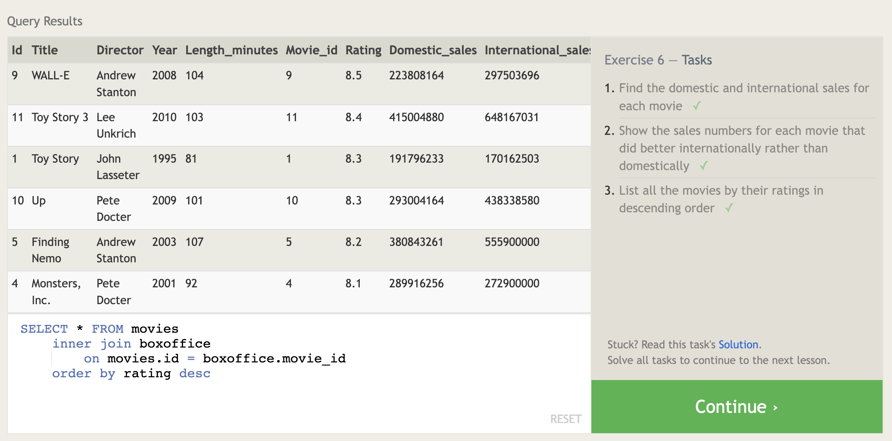
 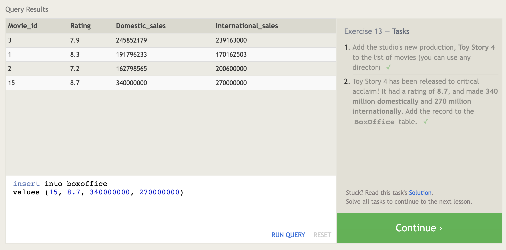
 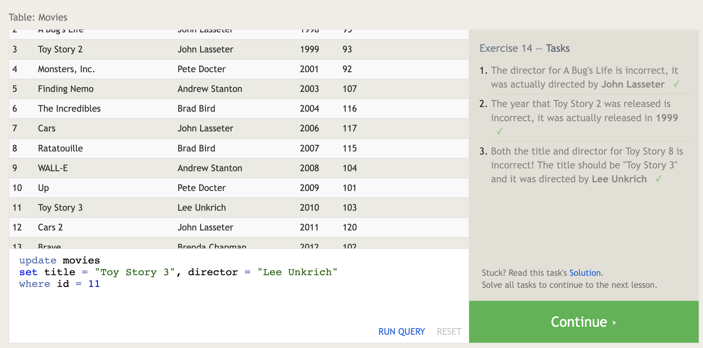
 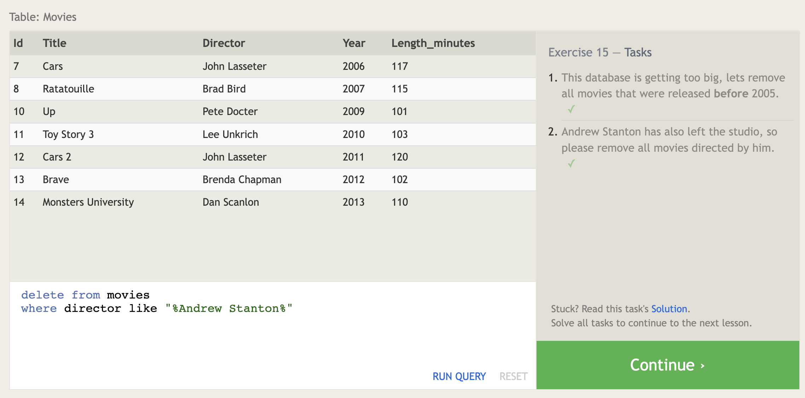
 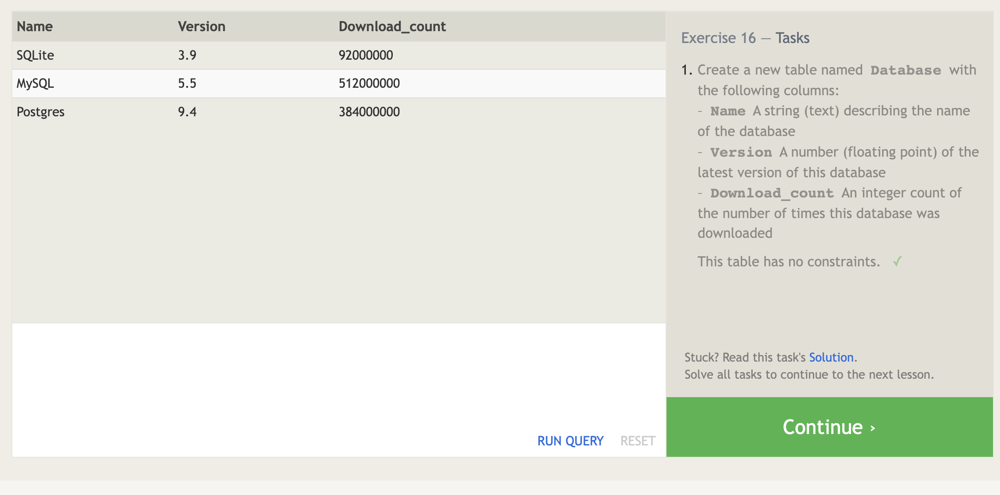
 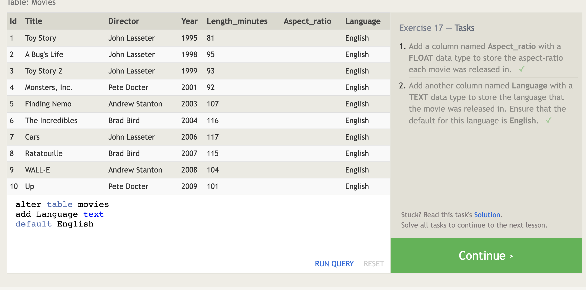
 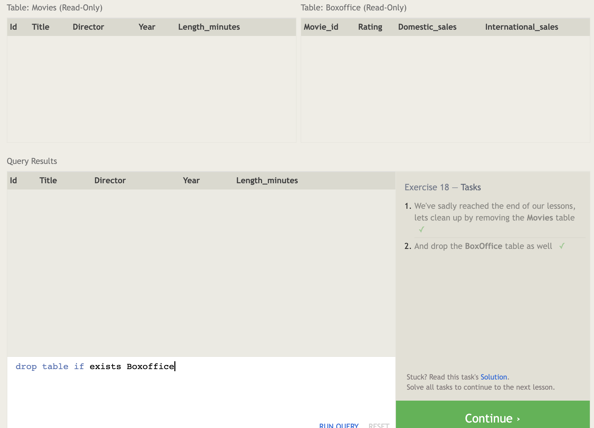

&copy; 2022, NoMichi
